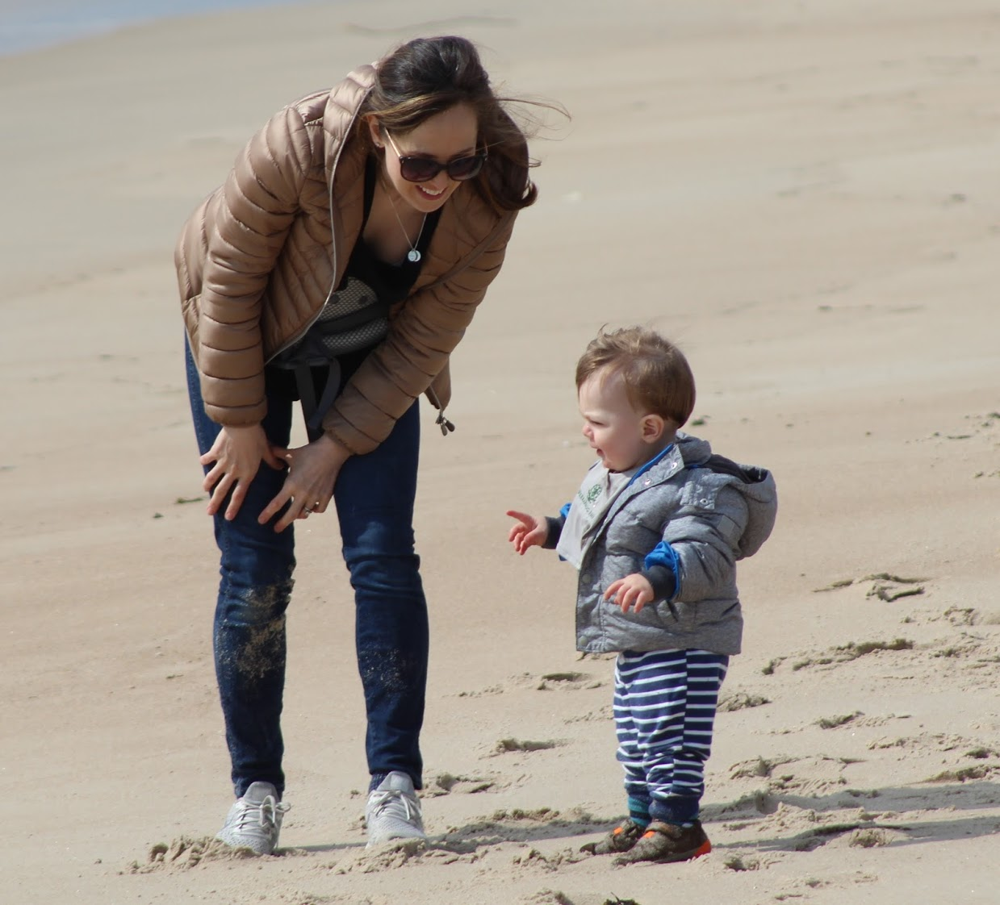

### This is Lisa Eisler (Lareau) MD's first website!

I am an anesthesiologist, if you believe [doximity](doximity.com/profiles/37aa21f6-e78c-448e-a3e6-f85f511361a7).

So far, I have a [Resume](Curriculum_Vitae.html) and some basic plots created in my Data Science class.

Find my code for various homework assignments on [github](github.com/lisaeisler). If you'd like you can [email](ldl2113@cumc.columbia.edu) me with any questions.

# I like summertime and making sand castles

Even if it's winter, I'm on the beach with my kiddos.

# My most used sites

I have been reading this article a lot recently about [posture](https://www.nature.com/articles/s41598-018-21625-1).